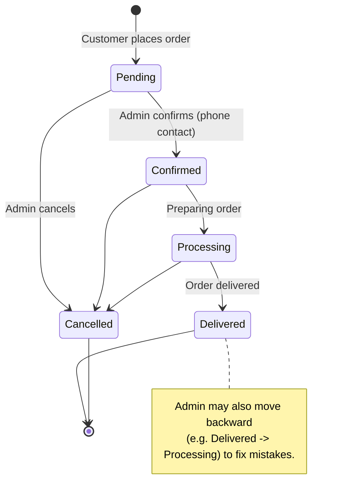
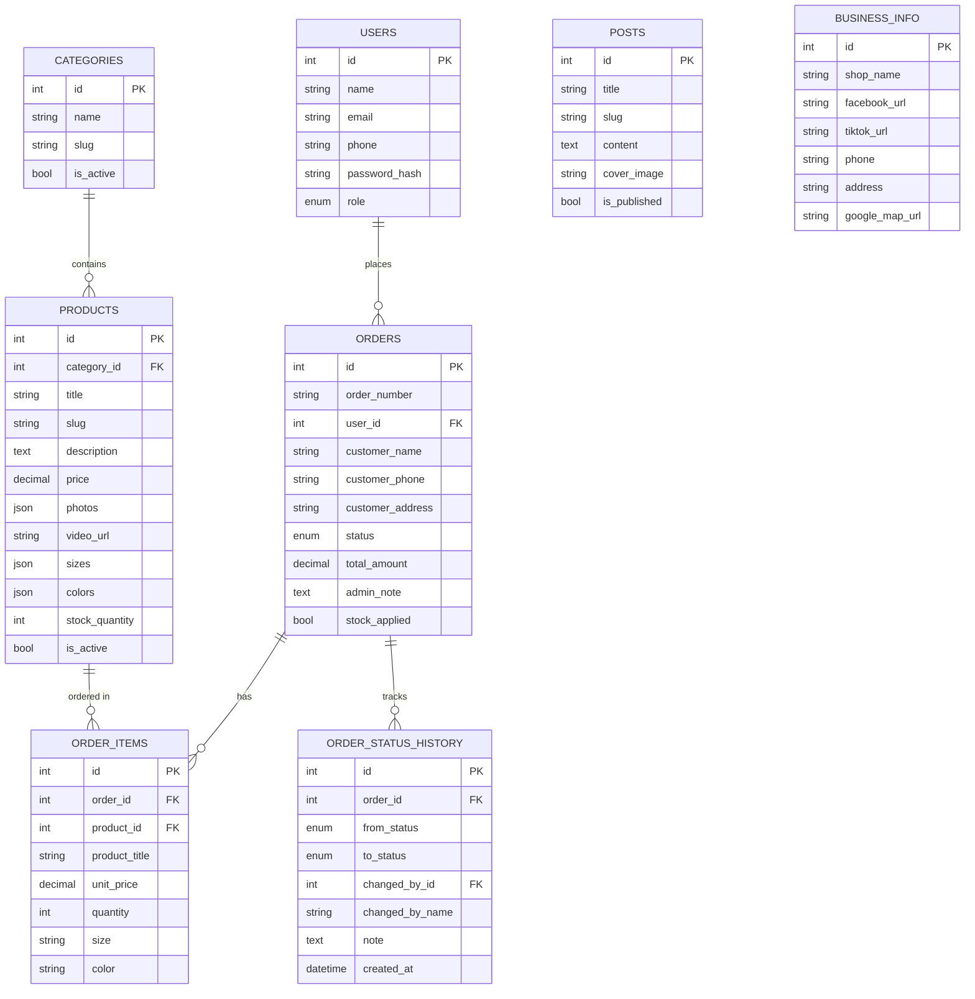

<!--
NOTE FOR AI AGENTS: This file is a Myanmar-language translation intended for HUMAN developers only.
AI agents should read the canonical English spec at docs/feature-spec.md instead. Do not use this file as a source of truth.
-->

# Kay - Kachin Handloom Weaving — Feature Specification (မြန်မာဘာသာ)

> အခြေအနေ: Draft v1 (သုံးသပ်ရန်)
> ရိုးရာ ကချင်ရက်ကန်းထည် ပစ္စည်းများအတွက် e-commerce + အသိပညာမျှဝေမှု platform တစ်ခု။
>
> _ဤ file သည် developer (လူ) များ ဖတ်ရန်အတွက်သာ ဖြစ်ပါသည်။ မူရင်း (source of truth) မှာ `docs/feature-spec.md` (English) ဖြစ်သည်။_

---

## 1. အကျဉ်းချုပ် (Overview)

Kay သည် ရိုးရာ ကချင်ရက်ကန်းထည် ပစ္စည်းများကို ပြသရောင်းချခြင်း၊ ရက်ကန်းနှင့်ပတ်သက်သော အသိပညာများ မျှဝေခြင်း၊ နှင့် customer များ order တင်နိုင်ပြီး အဆိုပါ order များကို ဆိုင်ရှင် (admin) က ဖုန်းဖြင့် တိုက်ရိုက်ဆက်သွယ်၍ အတည်ပြုဆောင်ရွက်ပေးသော small-business e-commerce platform တစ်ခု ဖြစ်သည်။

Platform တွင် deploy လုပ်နိုင်သော application သုံးခု ပါဝင်သည်-

- **Web** — customer များအတွက် အများမြင် storefront (browse, cart, order, post ဖတ်)။
- **Dashboard** — business info, catalog, stock, order, post, user များ စီမံရန် admin panel။
- **API** — REST endpoint, auth, integration များ ပံ့ပိုးပေးသော backend service။

### အဓိက ဆုံးဖြတ်ချက်များ (အတည်ပြုပြီး)

- **Repo structure:** သီးခြား repository သုံးခု — independent git repo သုံးခု: `kay-web`, `kay-dashboard`, `kay-api`။
- **Order notification:** order အသစ်ဝင်တိုင်း admin ထံ Telegram bot message ပို့သည်။
- **Checkout:** Guest checkout လုပ်နိုင်သည်; user account သည် **optional** (account ဖွင့်ထားသူများ order history ကြည့်နိုင်)။
- **Payment:** Online payment မရှိ။ Admin က customer ကို ဖုန်းဖြင့်ဆက်သွယ်၍ ငွေပေးချေမှု/ပို့ဆောင်မှု စီစဉ်သည်။
- **Media storage:** product photo/video များအတွက် DigitalOcean Spaces (S3-compatible object storage)။
- **Multi-language:** UI label များကို MM/EN ဖြင့် localize လုပ်သည်၊ default မှာ **MM**။ Product/post content ကို ဘာသာစကားတစ်ခုတည်းဖြင့်သာ သိမ်းသည် (ဘာသာစကားအလိုက် ထပ်မသိမ်း)။
- **Responsive:** Web နှင့် Dashboard နှစ်ခုလုံး fully responsive / mobile-friendly (ဖုန်းတွင် အသုံးပြုနိုင်)။
- **Order status flow:** `Pending → Confirmed → Processing → Delivered → Cancelled`။

---

## 2. Tech Stack

| Layer | Technology |
|-------|------------|
| Web (storefront) | React + Vite |
| Dashboard (admin) | React + Vite |
| API | Node.js + Express |
| Auth | JWT (access + refresh tokens) |
| Database | MySQL |
| Media | DigitalOcean Spaces (S3-compatible) |
| Notifications | Telegram Bot API |
| i18n | react-i18next (UI only) |

### အကြံပြု supporting libraries

- **API:** Express, Prisma သို့မဟုတ် Sequelize (ORM), `jsonwebtoken`, `bcrypt`, `zod`/`joi` (validation), `multer` (upload buffer), AWS SDK v3 (`@aws-sdk/client-s3`, DigitalOcean Spaces endpoint အတွက် config လုပ်), `node-telegram-bot-api` သို့မဟုတ် Telegram HTTP API တိုက်ရိုက်။
- **Frontend:** React Router, TanStack Query (data fetching), Axios, react-i18next, **Tailwind CSS**, React Hook Form + Zod။

---

## 3. Repository Structure

သီးခြား (independent) repository သုံးခု၊ တစ်ခုစီတွင် ကိုယ်ပိုင် git history, dependencies, deploy pipeline ရှိသည်။

### `kay-api` (Express + MySQL)
```
kay-api/
├── src/
│   ├── config/         # env, db, spaces/s3, telegram
│   ├── middleware/     # auth (JWT), validation, error handler
│   ├── modules/        # auth, business-info, categories, products,
│   │                   #   stock, orders, posts, users, uploads
│   ├── routes/
│   ├── utils/
│   └── app.ts / server.ts
├── prisma/ (or models/) # schema + migrations + seed
├── .env.example
└── package.json
```

### `kay-web` (React + Vite — storefront)
```
kay-web/
├── src/
│   ├── api/            # axios client + endpoint hooks
│   ├── components/
│   ├── pages/          # home, category, product, cart, checkout, posts
│   ├── i18n/           # mm.json, en.json (default MM)
│   ├── store/          # cart state
│   └── main.tsx
├── .env.example
└── package.json
```

### `kay-dashboard` (React + Vite — admin)
```
kay-dashboard/
├── src/
│   ├── api/
│   ├── components/
│   ├── pages/          # login, business-info, categories, products,
│   │                   #   stock, orders, posts, users
│   ├── i18n/
│   └── main.tsx
├── .env.example
└── package.json
```

> **Shared types/contracts:** repo များ သီးခြားဖြစ်သောကြောင့် API contract type များကို frontend repo တစ်ခုစီတွင် သီးခြားထိန်းသိမ်းသည် (သို့မဟုတ် နောက်ပိုင်းတွင် shared npm package အသေးတစ်ခုအဖြစ် publish လုပ်နိုင်)။ i18n translation file များကိုလည်း frontend repo တစ်ခုစီတွင် သီးခြားထားသည်။
>
> Repo တစ်ခုစီ သီးခြား run/deploy လုပ်သည်။ `kay-web` နှင့် `kay-dashboard` များက `kay-api` ကို config လုပ်ထားသော base URL (`VITE_API_BASE_URL`) ဖြင့် HTTP မှတစ်ဆင့် ခေါ်သုံးသည်။

---

## 4. User Roles & Permissions

| Role | ဖော်ပြချက် | Access |
|------|-------------|--------|
| **Guest** | login မဝင်ထားသူ | catalog browse, post ဖတ်, cart ဆောက်, guest order တင် |
| **User** | account ဖွင့်ထားသော customer (optional) | guest လုပ်နိုင်သမျှ အပြင် profile သိမ်း + order history |
| **Admin** | ဆိုင်ဝန်ထမ်း/ပိုင်ရှင် | Dashboard အပြည့်အဝ: business info, categories, products, stock, orders, posts, users |

### မှတ်ချက်များ
- Guest များ name + phone + address ဖြင့် checkout ပြီးနိုင်သည် — account မလို။
- User များ login ဝင်ပြီး ယခင် order များ ကြည့်ခြင်း၊ သိမ်းထားသော contact info ပြန်သုံးခြင်း ပြုလုပ်နိုင်သည်။
- Admin account များကို seed/initial setup ဖြင့် ဖန်တီးသည်; "super admin" တစ်ဦးက admin အပို ဖန်တီးနိုင် (optional, phase 2)။
- Dashboard route အားလုံးတွင် Admin JWT လိုအပ်သည်။

---

## 5. Feature Specifications

### 5.1 Business Info

Admin စီမံသော record တစ်ခုတည်း (သို့မဟုတ် key-value) configuration၊ Web (footer, contact page, header) တွင် ပြသသည်။

**Fields:**
- ဆိုင်အမည်, tagline/အကျဉ်းချုပ် ဖော်ပြချက်
- Facebook URL
- TikTok URL
- ဖုန်းနံပါတ် (တစ်ခု သို့မဟုတ် ပိုများ)
- Email (optional)
- လိပ်စာ (စာသား)
- Google Maps link / embed (lat-lng သို့မဟုတ် place URL)
- ဖွင့်ချိန် (optional)
- Logo image

**Behavior:**
- Admin က Dashboard → Settings/Business Info မှ ပြင်သည်။
- Web က public `GET /api/business-info` endpoint ကို သုံးသည်။

---

### 5.2 Categories

Product များကို browse လုပ်နိုင်သော အုပ်စုများအဖြစ် စီစဉ်သည်။

**Fields:**
- `id`, `name`, `slug`, `description` (optional), `image` (optional), `sort_order`, `is_active`, timestamps။

**Behavior:**
- Admin က Dashboard တွင် CRUD လုပ်သည်။
- Web က active category များ ပြသသည်; category page တွင် ၎င်း၏ product များ ပြသည်။
- (Optional phase 2) nested/sub-category — v1 အတွက် scope ပြင်ပ (တောင်းဆိုမှသာ)။

---

### 5.3 Products

Catalog ၏ အဓိက item။

**Fields:**
- `id`, `category_id`, `title`, `slug`
- `description` (rich text / long text)
- `price` (decimal)
- `photos` (အများ, ordered; cloud URLs)
- `video` (optional, cloud URL တစ်ခု)
- `sizes` (size option list, ဥပမာ S/M/L သို့မဟုတ် custom label)
- `colors` (color option list, label + optional hex/swatch)
- `stock_quantity` (Stock Management ကို ကြည့်)
- `is_active` / `is_published`
- `is_featured` (optional, homepage highlight အတွက်)
- timestamps

**v1 အတွက် Variant handling:**
- Sizes နှင့် colors များသည် ပြသရန်နှင့် order detail အတွက် **selectable attribute** များ ဖြစ်သည် (customer က cart ထည့်စဉ် size/color ရွေးသည်)။
- v1 ကို ရိုးရှင်းစေရန် stock ကို size/color ပေါင်းစပ်အလိုက် မဟုတ်ဘဲ **product level** (quantity တစ်ခုတည်း) တွင် တွက်သည်။ (Per-variant stock သည် phase-2 option — လိုအပ်က ပြောပါ။)

**Behavior:**
- Admin CRUD — image အများ upload + optional video upload (cloud သို့)။
- Web: product listing (grid, category ဖြင့် filter, title ဖြင့် search), image gallery + size/color selector + add-to-cart ပါသော product detail page။

---

### 5.4 Stock Management

**Fields/concepts:**
- product တစ်ခုစီအတွက် `stock_quantity`။
- `low_stock_threshold` (optional, dashboard သတိပေးချက်အတွက်)။

**Behavior:**
- Admin က product edit သို့မဟုတ် သီးခြား stock view မှ stock သတ်မှတ်/ပြင်နိုင်သည်။
- Order သည် stock-consuming status (`Confirmed`, `Processing`, သို့မဟုတ် `Delivered`) သို့ ပထမဆုံး ရောက်ချိန် stock လျှော့သည် — လက်တွေ့တွင် admin **Confirm** လုပ်ချိန်။ `stock_applied` flag ဖြင့် တစ်ကြိမ်သာ လျှော့ကြောင်း ထိန်းသည်။ (အတည်ပြုပြီး ဆုံးဖြတ်ချက်။)
- **status နောက်ပြန်ပြောင်းလျှင် stock ပြန်ပေါင်း:** order ကို stock-consuming status မှ non-consuming (`Pending`/`Cancelled`) သို့ ပြန်ပြောင်းလျှင် လျှော့ထားသော stock ကို ပြန်ထည့်ပေးသည်။ `stock_applied` flag ကြောင့် status ဘယ်နှကြိမ် ရှေ့ပြန်/နောက်ပြန် ပြောင်းသည်ဖြစ်စေ stock ကို နှစ်ထပ်မလျှော့/နှစ်ထပ်မပေါင်းပေ။ consuming status သို့ ရှေ့သို့ ပြန်ပြောင်းချိန် stock လုံလောက်မှု ပြန်စစ်သည်။
- stock = 0 ဆိုလျှင် Web တွင် "Out of stock" ပြပြီး add-to-cart ကို disable လုပ်သည်။
- Dashboard တွင် low-stock / out-of-stock ညွှန်ပြချက်များ ပြသည်။

---

### 5.5 Cart & Order System

**Cart (client-side):**
- Guest များအတွက် browser (localStorage) တွင် သိမ်းသည်; login ဝင်ထားသူများအတွက် optional sync (phase 2)။
- Cart item = product + ရွေးထားသော size + ရွေးထားသော color + quantity။
- Subtotal (price × quantity), order total ပြသည်။ v1 တွင် tax/shipping တွက်ချက်မှု မရှိ (ပို့ဆောင်မှုကို ဖုန်းဖြင့် စီစဉ်)။

**Checkout / Order placement:**
- Customer က cart ပြန်ကြည့် → contact form ဖြည့်-
  - Name (required)
  - Phone (required)
  - Address (required — ပို့ဆောင်မှုအတွက် လို)
  - Note/remark (optional)
- Submit လုပ်လျှင် → `POST /api/orders` က status `Pending` ဖြင့် order ဖန်တီးသည်။
- **Admin ထံ Telegram message ပို့သည်** (order summary: customer name, phone, items, total)။
- Customer က order confirmation screen မြင်ရသည် (order number + "Admin will contact you by phone")။

**Order entity fields:**
- `id`, `order_number`
- `user_id` (nullable — guest အတွက် null)
- `customer_name`, `customer_phone`, `customer_address`, `note`
- `status` (enum: Pending, Confirmed, Processing, Delivered, Cancelled)
- `total_amount`
- `order_items[]`: `product_id`, `product_title` (snapshot), `unit_price` (snapshot), `quantity`, `size`, `color`
- `admin_note` (internal)
- `stock_applied` (bool — ဤ order အတွက် stock လျှော့ပြီးပြီလား; status ရှေ့ပြန်/နောက်ပြန် ပြောင်းချိန် stock ညီညွတ်စေရန် သုံး)
- timestamps, `confirmed_at`, စသည်။

**Order status history entity fields:**
- `id`, `order_id` (FK)
- `from_status` (nullable — order ဖန်တီးချိန် ပထမ entry အတွက် null)
- `to_status`
- `changed_by_id` (nullable FK users — ပြောင်းသော admin), `changed_by_name` (snapshot)
- `note` (optional အကြောင်းပြ)
- `created_at`

**Admin order management (Dashboard):**
- Order များကို filter ဖြင့် list (status, date, phone/name search)။
- Order detail ကြည့်။
- **Order ပြင်:** item quantity ပြောင်း, item ထည့်/ဖျက်, customer contact info update, total ချိန်ညှိ။
- **status ကို လွတ်လပ်စွာ ပြောင်း** — admin သည် status ကို အခြား status **မည်သည့်တစ်ခုသို့မဆို**, **ရှေ့ပြန်/နောက်ပြန်** ပြောင်းနိုင်သည် (ဥပမာ မှားယွင်းမှု ပြင်ရန် `Delivered → Processing`, သို့မဟုတ် ပယ်ဖျက်ထားသော order ကို `Pending` သို့ ပြန်ဖွင့်)။ ပုံမှန် (happy path) မှာ `Pending → Confirmed → Processing → Delivered` ဖြစ်သည်။
- **Status ပြောင်းလဲမှု မှတ်တမ်း (history):** status ပြောင်းတိုင်း မှတ်တမ်းတင်သည် (from-status, to-status, ပြောင်းသော admin, optional အကြောင်းပြ note, နှင့် timestamp) — order detail page တွင် timeline အဖြစ် ပြသည်။ status ပြောင်းစဉ် အကြောင်းပြ note (optional) တွဲတင်နိုင်သည်။
- Internal admin note များ။

**Order status workflow:**

အောက်ပါ diagram သည် ပုံမှန် (happy-path) flow ဖြစ်သည်။ v1 တွင် admin သည် ဤ edge များအတိုင်းသာ **ကန့်သတ်မထား** — status တစ်ခုကို အခြားတစ်ခုသို့ (ရှေ့ပြန်/နောက်ပြန်) ပြောင်းနိုင်ပြီး stock နှင့် history ကို အလိုအလျောက် ညီညွတ်အောင် ထိန်းသည် (Stock Management ကို ကြည့်)။



**Telegram notification အသေးစိတ်:**
- Config လုပ်ထားသော bot token + admin chat ID (env vars) ဖြင့် order အသစ်တိုင်း (နှင့် optional status ပြောင်းချိန်) formatted message ပို့သည်။
- Notify မအောင်မြင်လျှင် order ဖန်တီးမှုကို မပိတ်ဆို့ရ (notification သည် best-effort, error များ log လုပ်)။

---

### 5.6 Knowledge Sharing Posts

ကချင်ရက်ကန်း ယဉ်ကျေးမှု, နည်းစနစ်, ပစ္စည်းများအကြောင်း blog-style ဆောင်းပါးများ။

**Fields:**
- `id`, `title`, `slug`, `cover_image`, `content` (rich text), `excerpt`, `author` (admin), `is_published`, `published_at`, `tags` (optional), timestamps။

**Behavior:**
- Admin CRUD — rich text editor + cover image upload။
- Web: post list page + post detail page။ Published post များသာ။

---

### 5.7 Multi-Language (i18n)

- **Scope:** UI label, button, menu, system message များ — MM နှင့် EN အတွက် localize။
- **Default language:** MM။
- Web တွင် language switcher (Dashboard optional)။
- `react-i18next` ဖြင့် အကောင်အထည်ဖော်; translation file (`mm.json`, `en.json`) များကို frontend repo တစ်ခုစီ၏ `src/i18n/` တွင် ထားသည်။
- **Product/post content ကို ဘာသာစကားအလိုက် ထပ်မသိမ်း** (admin ရိုက်ထည့်သည့်အတိုင်း သိမ်း)။ UI chrome သာ ဘာသာပြန်သည်။

---

## 6. API Design (REST)

Base path: `/api`။ JSON response။ Protected route များတွင် `Authorization: Bearer <token>` JWT။

### Auth
- `POST /auth/register` — user registration (optional account)
- `POST /auth/login` — user/admin login → access + refresh tokens
- `POST /auth/refresh` — access token refresh
- `POST /auth/logout`
- `GET /auth/me` — လက်ရှိ user/admin

### Public (Web)
- `GET /business-info`
- `GET /categories`
- `GET /products` (query: category, search, page, sort)
- `GET /products/:slug`
- `GET /posts`
- `GET /posts/:slug`
- `POST /orders` — order တင် (guest သို့မဟုတ် user)
- `GET /me/orders` — login ဝင်ထားသူ၏ order history

### Admin (Dashboard, role = Admin)
- `PUT /admin/business-info`
- `GET/POST/PUT/DELETE /admin/categories`
- `GET/POST/PUT/DELETE /admin/products`
- `PUT /admin/products/:id/stock`
- `POST /admin/uploads` — signed upload ရယူ / DigitalOcean Spaces သို့ proxy။ `folder` param လက်ခံ (ဥပမာ `banner`, `products`, `categories`, `posts`, `business`); server က final key ကို `kay-upload/<folder>/...` အဖြစ် အတင်းသတ်မှတ်ပြီး ခွင့်ပြုစာရင်းပြင်ပ value များကို ငြင်းသည်။
- `GET /admin/orders`, `GET /admin/orders/:id`
- `PUT /admin/orders/:id` — order items/contact ပြင်
- `PATCH /admin/orders/:id/status` — status ကို အခြားတစ်ခုသို့ (ရှေ့ပြန်/နောက်ပြန်) ပြောင်း; body: `{ status, note? }`။ status-history entry မှတ်တမ်းတင်ပြီး stock ကို အလိုအလျောက် ချိန်ညှိသည်။ order detail (`GET /admin/orders/:id`) က `statusHistory[]` အပြည့်အစုံ ပြန်ပေးသည်။
- `GET/POST/PUT/DELETE /admin/posts`
- `GET /admin/users` (customer list; phase-2 admin management)

> Endpoint list သည် ညွှန်ပြချက်သာ; နောက်ဆုံး route များကို implementation စဉ် ပြန်ချိန်ညှိမည်။

---

## 7. Data Model (MySQL — high level)



---

## 8. Non-Functional / Cross-Cutting

- **Auth security:** bcrypt password hashing, JWT access (သက်တမ်းတို) + refresh token, admin route များတွင် role-based middleware။
- **Validation:** write endpoint အားလုံးတွင် request validation (Zod/Joi)။
- **Error handling:** တူညီသော JSON error format, central error middleware။
- **Media:** cloud upload များကို type/size ဖြင့် validate; URL များကို DB တွင် သိမ်း။ **Upload အားလုံးကို DigitalOcean Space ထဲတွင် `kay-upload/` key prefix တစ်ခုတည်းအောက်တွင်သာ သိမ်းရမည်**၊ domain အလိုက် subfolder ခွဲ — ဥပမာ `kay-upload/banner/*`, `kay-upload/products/*`, `kay-upload/categories/*`, `kay-upload/posts/*`, `kay-upload/business/*` (logo)။ Base prefix ကို config တွင် ဗဟိုချုပ်ကိုင် (ဥပမာ `SPACES_BASE_PREFIX=kay-upload`) ပြီး upload helper တစ်ခုစီက ၎င်း၏ subfolder ကို ဆက်ထည့်သည်။ အကြံပြု file naming: collision မဖြစ်စေရန် `kay-upload/<subfolder>/<uuid-or-slug>-<timestamp>.<ext>`။
- **Config:** DB, JWT secrets, DigitalOcean Spaces (endpoint, region, bucket, access key, secret, **base key prefix** `SPACES_BASE_PREFIX=kay-upload`, public base URL), Telegram bot token + admin chat ID အတွက် environment variable များ။
- **Currency:** MMK (မြန်မာကျပ်) — Ks အဖြစ် ပြသ/format လုပ်။
- **Responsive UI:** **Web နှင့် Dashboard နှစ်ခုလုံး fully responsive / mobile-friendly ဖြစ်ရမည်။** Web သည် mobile-first (customer အများစု ဖုန်းသုံး)။ Dashboard ကိုလည်း ဖုန်းတွင် အဆင်ပြေစွာ သုံးနိုင်ရမည် — admin လုပ်ငန်းများ (order/product/stock စီမံ, order status ပြောင်း) ကို screen သေးသေးတွင် responsive layout ဖြင့် လုပ်နိုင်ရမည်: collapsible sidebar/hamburger nav, viewport ကျဉ်းချိန်တွင် card-based list သို့မဟုတ် ဘေးတိုက် scroll လုပ်နိုင်သော table, touch-friendly tap target, mobile တွင် single-column သို့ ပြောင်းသော form များ။
- **Seeding:** dev အတွက် initial admin account + နမူနာ category/product များ။

---

## 9. Out of Scope (v1) / အနာဂတ် Phase များ

- Online payment gateway integration။
- Per-size/per-color stock tracking (variant-level inventory)။
- Multi-language **content** (product/post စာသား ဘာသာပြန်)။
- Nested categories။
- Customer review/rating။
- Wishlist / device အကြား cart sync။
- Admin management UI အများ / granular permission များ။

> ၎င်းတို့ထဲမှ v1 သို့ ရွှေ့လိုသည်များ ရှိက ပြောပါ။

---

## 10. အတည်ပြုပြီး ဆုံးဖြတ်ချက်များ (Confirmed Decisions)

ယခင် open question အားလုံး ဖြေရှင်းပြီး-

1. **Stock လျှော့ချိန်:** order သည် stock-consuming status သို့ ပထမဆုံးရောက်ချိန် (admin **Confirm**) လျှော့; နောက်ပိုင်း `Pending`/`Cancelled` သို့ ပြန်ပြောင်းလျှင် အလိုအလျောက် ပြန်ပေါင်း (`stock_applied` flag ဖြင့် ထိန်း)။
2. **Address လိုအပ်မှု:** checkout တွင် **မဖြစ်မနေ လိုအပ်** (ပို့ဆောင်မှုအတွက်)။
3. **Telegram:** bot token + admin chat ID ရှိပြီးသား — API env vars (`TELEGRAM_BOT_TOKEN`, `TELEGRAM_ADMIN_CHAT_ID`) ဖြင့် ပေး။
4. **Media provider:** **DigitalOcean Spaces** (S3-compatible, AWS SDK v3 + custom endpoint)။
5. **Styling system:** **Tailwind CSS** (frontend နှစ်ခုလုံး)။
6. **Currency:** **MMK** (မြန်မာကျပ်), Ks အဖြစ် ပြသ။
7. **Order status ပြောင်းခြင်း:** Admin သည် order status ကို **မည်သည့်တစ်ခုသို့မဆို**, **ရှေ့ပြန်/နောက်ပြန်** ပြောင်းနိုင်သည် (linear workflow အတိုင်း ကန့်သတ်မထား)။ ပြောင်းတိုင်း **order status history** (from/to, admin, optional အကြောင်းပြ note, timestamp) တွင် မှတ်တမ်းတင်ပြီး dashboard တွင် timeline အဖြစ် ပြသည်။
