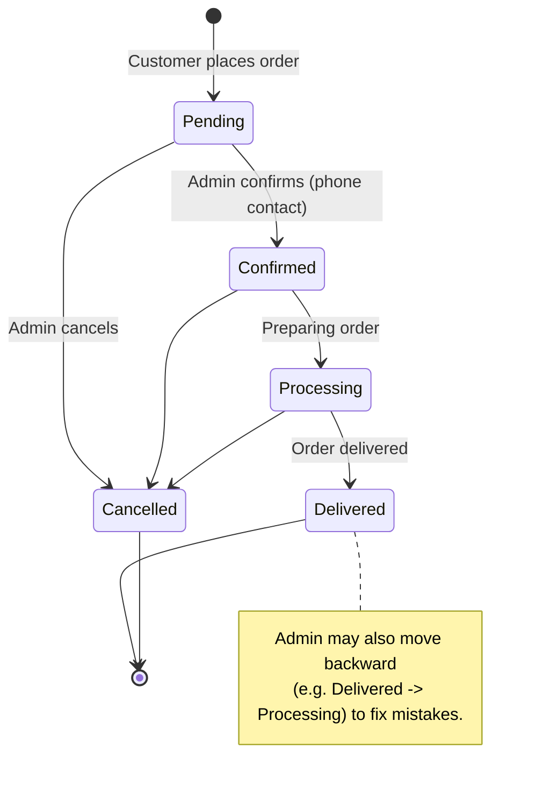
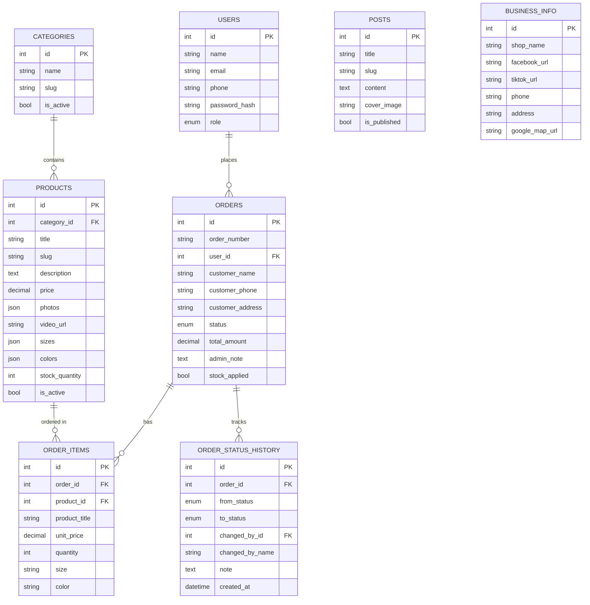

# Kay - Kachin Handloom Weaving — Feature Specification

> Status: Draft v1 (for review)
> An e-commerce + knowledge-sharing platform for traditional Kachin handloom weaving products.

---

## 1. Overview

Kay is a small-business e-commerce platform that showcases and sells traditional Kachin handloom weaving products, shares weaving knowledge, and lets customers place orders that are confirmed and fulfilled through direct contact (phone) with the shop admin.

The platform has three deployable applications:

- **Web** — public-facing storefront for customers (browse, cart, order, read posts).
- **Dashboard** — admin panel to manage business info, catalog, stock, orders, posts, and users.
- **API** — backend service exposing REST endpoints, auth, and integrations.

### Key product decisions (confirmed)

- **Repo structure:** Separate repositories — three independent git repos: `kay-web`, `kay-dashboard`, `kay-api`.
- **Order notification:** Telegram bot message to admin on new order.
- **Checkout:** Guest checkout supported; user accounts are **optional** (registered users get order history).
- **Payment:** No online payment. Admin contacts the customer by phone to arrange payment/delivery.
- **Media storage:** DigitalOcean Spaces (S3-compatible object storage) for product photos/videos.
- **Multi-language:** UI labels are localized (MM/EN), default **MM**. Product/post content is stored in a single language (not duplicated per language).
- **Responsive:** Both Web and Dashboard are fully responsive / mobile-friendly (usable on phones).
- **Order status flow:** `Pending → Confirmed → Processing → Delivered → Cancelled`.

---

## 2. Tech Stack

| Layer | Technology |
|-------|------------|
| Web (storefront) | React + Vite |
| Dashboard (admin) | React + Vite |
| API | Node.js + Express |
| Auth | JWT (access + refresh tokens) |
| Database | MySQL |
| Media | DigitalOcean Spaces (S3-compatible) |
| Notifications | Telegram Bot API |
| i18n | react-i18next (UI only) |

### Suggested supporting libraries

- **API:** Express, Prisma or Sequelize (ORM), `jsonwebtoken`, `bcrypt`, `zod`/`joi` (validation), `multer` (upload buffer), AWS SDK v3 (`@aws-sdk/client-s3`, configured for DigitalOcean Spaces endpoint), `node-telegram-bot-api` or direct Telegram HTTP API.
- **Frontend:** React Router, TanStack Query (data fetching), Axios, react-i18next, **Tailwind CSS**, React Hook Form + Zod.

---

## 3. Repository Structure

Three **independent** repositories, each with its own git history, dependencies, and deploy pipeline.

### `kay-api` (Express + MySQL)
```
kay-api/
├── src/
│   ├── config/         # env, db, cloudinary/s3, telegram
│   ├── middleware/     # auth (JWT), validation, error handler
│   ├── modules/        # auth, business-info, categories, products,
│   │                   #   stock, orders, posts, users, uploads
│   ├── routes/
│   ├── utils/
│   └── app.ts / server.ts
├── prisma/ (or models/) # schema + migrations + seed
├── .env.example
└── package.json
```

### `kay-web` (React + Vite — storefront)
```
kay-web/
├── src/
│   ├── api/            # axios client + endpoint hooks
│   ├── components/
│   ├── pages/          # home, category, product, cart, checkout, posts
│   ├── i18n/           # mm.json, en.json (default MM)
│   ├── store/          # cart state
│   └── main.tsx
├── .env.example
└── package.json
```

### `kay-dashboard` (React + Vite — admin)
```
kay-dashboard/
├── src/
│   ├── api/
│   ├── components/
│   ├── pages/          # login, business-info, categories, products,
│   │                   #   stock, orders, posts, users
│   ├── i18n/
│   └── main.tsx
├── .env.example
└── package.json
```

> **Shared types/contracts:** Since repos are independent, API contract types are duplicated/maintained per frontend repo (or optionally published as a small shared npm package later). The i18n translation files live separately in each frontend repo.
>
> Each repo runs and deploys independently. `kay-web` and `kay-dashboard` consume `kay-api` over HTTP via a configured base URL (`VITE_API_BASE_URL`).

---

## 4. User Roles & Permissions

| Role | Description | Access |
|------|-------------|--------|
| **Guest** | Unauthenticated visitor | Browse catalog, read posts, build cart, place guest order |
| **User** | Registered customer (optional account) | Everything a guest can, plus saved profile and order history |
| **Admin** | Shop staff/owner | Full access to Dashboard: business info, categories, products, stock, orders, posts, users |

### Notes
- Guests can complete checkout with name + phone + address — no account required.
- Users authenticate to view their past orders and reuse saved contact info.
- Admin accounts are created via seed/initial setup; a "super admin" can create additional admins (optional, phase 2).
- All Dashboard routes require an Admin JWT.

---

## 5. Feature Specifications

### 5.1 Business Info

Single-record (or key-value) configuration managed by Admin, displayed on the Web (footer, contact page, header).

**Fields:**
- Shop name, tagline/short description
- Facebook URL
- TikTok URL
- Phone number(s) (one or more)
- Email (optional)
- Physical address (text)
- Google Maps link / embed (lat-lng or place URL)
- Business hours (optional)
- Logo image

**Behavior:**
- Admin edits via Dashboard → Settings/Business Info.
- Web consumes a public `GET /api/business-info` endpoint.

---

### 5.2 Categories

Organize products into browsable groups.

**Fields:**
- `id`, `name`, `slug`, `description` (optional), `image` (optional), `sort_order`, `is_active`, timestamps.

**Behavior:**
- Admin CRUD in Dashboard.
- Web lists active categories; category page shows its products.
- (Optional phase 2) nested/sub-categories — out of scope for v1 unless requested.

---

### 5.3 Products

Core catalog item.

**Fields:**
- `id`, `category_id`, `title`, `slug`
- `description` (rich text / long text)
- `price` (decimal)
- `photos` (multiple, ordered; cloud URLs)
- `video` (optional, single cloud URL)
- `sizes` (list of size options, e.g. S/M/L or custom labels)
- `colors` (list of color options with label + optional hex/swatch)
- `stock_quantity` (see Stock Management)
- `is_active` / `is_published`
- `is_featured` (optional, for homepage highlight)
- timestamps

**Variant handling for v1:**
- Sizes and colors are **selectable attributes** for display and order detail (the customer picks size/color when adding to cart).
- Stock is tracked at the **product level** (single quantity), not per size/color combination, to keep v1 simple. (Per-variant stock is a phase-2 option — flag if needed.)

**Behavior:**
- Admin CRUD with multi-image upload + optional video upload to cloud.
- Web: product listing (grid, filter by category, search by title), product detail page with image gallery, size/color selectors, add-to-cart.

---

### 5.4 Stock Management

**Fields/concepts:**
- `stock_quantity` per product.
- `low_stock_threshold` (optional, for dashboard warnings).

**Behavior:**
- Admin can set/adjust stock from product edit or a dedicated stock view.
- Stock decrements when an order first reaches a **stock-consuming** status (`Confirmed`, `Processing`, or `Delivered`) — in practice, on admin **Confirm**. Tracked via the order's `stock_applied` flag so it is deducted only once. (Confirmed decision.)
- **Backward status changes restore stock:** if an order is moved back from a stock-consuming status to a non-consuming one (`Pending` or `Cancelled`), the previously deducted stock is added back. The `stock_applied` flag guarantees stock is never double-deducted or double-restored no matter how many times the status moves back and forth. A forward move into a consuming status re-checks stock sufficiency.
- If stock = 0, product shows "Out of stock" on Web and add-to-cart is disabled.
- Dashboard shows low-stock / out-of-stock indicators.

---

### 5.5 Cart & Order System

**Cart (client-side):**
- Stored in browser (localStorage) for guests; optionally synced for logged-in users (phase 2).
- Cart item = product + chosen size + chosen color + quantity.
- Shows subtotal (price × quantity), order total. No tax/shipping calc in v1 (delivery arranged by phone).

**Checkout / Order placement:**
- Customer reviews cart → fills contact form:
  - Name (required)
  - Phone (required)
  - Address (required — needed for delivery)
  - Note/remark (optional)
- On submit → `POST /api/orders` creates an order with status `Pending`.
- A **Telegram message is sent to admin** containing order summary (customer name, phone, items, total).
- Customer sees an order confirmation screen (order number + "Admin will contact you by phone").

**Order entity fields:**
- `id`, `order_number`
- `user_id` (nullable — null for guest)
- `customer_name`, `customer_phone`, `customer_address`, `note`
- `status` (enum: Pending, Confirmed, Processing, Delivered, Cancelled)
- `total_amount`
- `order_items[]`: `product_id`, `product_title` (snapshot), `unit_price` (snapshot), `quantity`, `size`, `color`
- `admin_note` (internal)
- `stock_applied` (bool — whether stock has already been deducted for this order; used to keep stock consistent across backward/forward status changes)
- timestamps, `confirmed_at`, etc.

**Order status history entity fields:**
- `id`, `order_id` (FK)
- `from_status` (nullable — null for the initial entry when the order is created)
- `to_status`
- `changed_by_id` (nullable FK to users — the admin who changed it), `changed_by_name` (snapshot)
- `note` (optional reason)
- `created_at`

**Admin order management (Dashboard):**
- List orders with filters (status, date, phone/name search).
- View order detail.
- **Edit order:** change item quantities, add/remove items, update customer contact info, adjust total.
- **Change status freely** — admin can move the status to **any** other status, **forward or backward** (e.g. correct a mistake by moving `Delivered → Processing`, or reopen a `Cancelled` order to `Pending`). The typical happy path is still `Pending → Confirmed → Processing → Delivered`.
- **Status change history:** every status change is recorded (from-status, to-status, the admin who made the change, an optional reason note, and a timestamp) and shown as a timeline on the order detail page. An optional reason note can be attached when changing status.
- Internal admin notes.

**Order status workflow:**

The diagram below shows the typical (happy-path) flow. In v1 the admin is **not restricted** to these edges — any status can be changed to any other status (forward or backward); stock and history are kept consistent automatically (see Stock Management).



**Telegram notification details:**
- A configured bot token + admin chat ID (env vars) used to send a formatted message on new order (and optionally on status changes).
- Failure to notify must not block order creation (notification is best-effort, errors logged).

---

### 5.6 Knowledge Sharing Posts

Blog-style articles about Kachin weaving culture, techniques, products.

**Fields:**
- `id`, `title`, `slug`, `cover_image`, `content` (rich text), `excerpt`, `author` (admin), `is_published`, `published_at`, `tags` (optional), timestamps.

**Behavior:**
- Admin CRUD with rich text editor + cover image upload.
- Web: post list page + post detail page. Published posts only.

---

### 5.7 Multi-Language (i18n)

- **Scope:** UI labels, buttons, menus, system messages — localized for MM and EN.
- **Default language:** MM.
- Language switcher in Web (and Dashboard optional).
- Implemented via `react-i18next` with translation files (`mm.json`, `en.json`) kept within each frontend repo's `src/i18n/`.
- **Product/post content is NOT duplicated** per language (stored as entered by admin). Only the surrounding UI chrome translates.

---

## 6. API Design (REST)

Base path: `/api`. JSON responses. JWT in `Authorization: Bearer <token>` for protected routes.

### Auth
- `POST /auth/register` — user registration (optional accounts)
- `POST /auth/login` — user/admin login → access + refresh tokens
- `POST /auth/refresh` — refresh access token
- `POST /auth/logout`
- `GET /auth/me` — current user/admin

### Public (Web)
- `GET /business-info`
- `GET /categories`
- `GET /products` (query: category, search, page, sort)
- `GET /products/:slug`
- `GET /posts`
- `GET /posts/:slug`
- `POST /orders` — place order (guest or user)
- `GET /me/orders` — logged-in user's order history

### Admin (Dashboard, role = Admin)
- `PUT /admin/business-info`
- `GET/POST/PUT/DELETE /admin/categories`
- `GET/POST/PUT/DELETE /admin/products`
- `PUT /admin/products/:id/stock`
- `POST /admin/uploads` — get signed upload / proxy to DigitalOcean Spaces. Accepts a `folder` param (e.g. `banner`, `products`, `categories`, `posts`, `business`); the server forces the final key to `kay-upload/<folder>/...` and rejects values outside the allowed list.
- `GET /admin/orders`, `GET /admin/orders/:id`
- `PUT /admin/orders/:id` — edit order items/contact
- `PATCH /admin/orders/:id/status` — change status to any other status (forward or backward); body: `{ status, note? }`. Records a status-history entry and adjusts stock automatically. The order detail (`GET /admin/orders/:id`) returns the full `statusHistory[]`.
- `GET/POST/PUT/DELETE /admin/posts`
- `GET /admin/users` (list customers; phase-2 admin management)

> Endpoint list is indicative; final routes refined during implementation.

---

## 7. Data Model (MySQL — high level)



---

## 8. Non-Functional / Cross-Cutting

- **Auth security:** bcrypt password hashing, JWT access (short-lived) + refresh tokens, role-based middleware on admin routes.
- **Validation:** request validation (Zod/Joi) on all write endpoints.
- **Error handling:** consistent JSON error format, central error middleware.
- **Media:** cloud uploads validated by type/size; store URLs in DB. **All uploads MUST be stored under a single `kay-upload/` key prefix in the DigitalOcean Space**, organized into subfolders by domain, e.g. `kay-upload/banner/*`, `kay-upload/products/*`, `kay-upload/categories/*`, `kay-upload/posts/*`, `kay-upload/business/*` (logo). The base prefix is centralized in config (e.g. `SPACES_BASE_PREFIX=kay-upload`) and each upload helper appends its subfolder. Recommended file naming: `kay-upload/<subfolder>/<uuid-or-slug>-<timestamp>.<ext>` to avoid collisions.
- **Config:** environment variables for DB, JWT secrets, DigitalOcean Spaces (endpoint, region, bucket, access key, secret, **base key prefix** `SPACES_BASE_PREFIX=kay-upload`, public base URL), Telegram bot token + admin chat ID.
- **Currency:** MMK (Myanmar Kyat) — displayed/formatted as Ks.
- **Responsive UI:** **Both Web and Dashboard are fully responsive and mobile-friendly.** Web is mobile-first (most customers on phone). Dashboard must also be usable on mobile phones — admin tasks (manage orders, products, stock, change order status) work on small screens via responsive layouts: collapsible sidebar/hamburger nav, card-based lists or horizontally scrollable tables on narrow viewports, touch-friendly tap targets, and forms that adapt to single-column on mobile.
- **Seeding:** initial admin account + sample categories/products for dev.

---

## 9. Out of Scope (v1) / Future Phases

- Online payment gateway integration.
- Per-size/per-color stock tracking (variant-level inventory).
- Multi-language **content** (translated product/post text).
- Nested categories.
- Customer reviews/ratings.
- Wishlist / cart sync across devices.
- Multiple admin management UI / granular permissions.

> Flag any of these if they should move into v1.

---

## 10. Confirmed Decisions

All previously open questions are now resolved:

1. **Stock decrement timing:** Decrement when the order first enters a stock-consuming status (admin **Confirm**); restored automatically if the status is later moved back to `Pending`/`Cancelled` (tracked via `stock_applied`).
2. **Address requirement:** **Required** at checkout (needed for delivery).
3. **Telegram:** Bot token + admin chat ID already available — supplied via API env vars (`TELEGRAM_BOT_TOKEN`, `TELEGRAM_ADMIN_CHAT_ID`).
4. **Media provider:** **DigitalOcean Spaces** (S3-compatible, via AWS SDK v3 with custom endpoint).
5. **Styling system:** **Tailwind CSS** (both frontends).
6. **Currency:** **MMK** (Myanmar Kyat), displayed as Ks.
7. **Order status changes:** Admin can change an order to **any** status, **forward or backward** (not restricted to a linear workflow). Every change is recorded in an **order status history** (from/to, admin, optional reason note, timestamp) and shown as a timeline on the dashboard.
