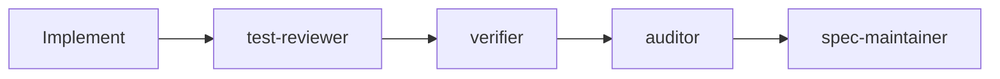

# Kay Platform — Cursor Subagents Guide

> How to invoke the custom subagents defined in `.cursor/agents/` for the Kay — Kachin Handloom Weaving platform.

---

## Overview

Subagents are specialized AI assistants with focused instructions for a specific job (frontend work, backend work, verification, auditing, testing, spec sync). They run in an isolated context so the main chat stays clean.

**Agent definitions live at:**

```
.cursor/agents/
├── frontend-developer.md
├── backend-developer.md
├── verifier.md
├── auditor.md
├── test-reviewer.md
└── spec-maintainer.md
```

**Canonical spec (read by agents):** `docs/feature-spec.md`

---

## How to invoke

In Cursor chat, mention the subagent by name. You can use natural language or the slash-style prefix:

```
Use the auditor subagent to review the recent auth changes
```

```
/frontend-developer add dark mode to kay-dashboard
```

```
Use the test-reviewer subagent to verify order status flow against the spec
```

```
Use the verifier subagent to review order status flow against the spec
```

**Tips for better results:**

- Name the **app** (`kay-web`, `kay-dashboard`, `kay-api`) and **module/feature** when possible.
- Point to recent work: "after the checkout refactor", "the order status history feature".
- Say what you want back: "audit only", "implement and build", "sync spec and report gaps".

---

## Recommended workflow

After significant feature work, this sequence keeps quality high without overlap:



| Step | Subagent | Why |
|------|----------|-----|
| 1 | **frontend-developer** or **backend-developer** | Build or change the feature |
| 2 | **test-reviewer** | Verify spec compliance; add high-value tests only |
| 3 | **verifier** | Read-only review: correctness, completeness, spec alignment, code quality |
| 4 | **auditor** | Read-only production risk review before merge/release |
| 5 | **spec-maintainer** | Update `docs/feature-spec.md` to match implementation |

Skip steps that do not apply (e.g. docs-only change → skip frontend-developer).

---

## Subagent reference

### 1. `frontend-developer`

**Purpose:** Implement UI, pages, components, forms, data fetching, auth flows, i18n, and theming in **kay-web** and **kay-dashboard**.

**When to use:**

- New or changed storefront/admin pages
- Design system, dark mode, responsive layout
- React Query, Zustand, forms, MM/EN translations

**Does:** Write and refactor frontend code; run `npm run build` in affected apps.

**Does not:** Modify `kay-api` unless the task explicitly requires it.

**Example prompts:**

```
Use the frontend-developer subagent to add a product filter sidebar on kay-web ProductsPage
```

```
/frontend-developer refactor kay-dashboard orders list to use shared ErrorState and dark mode
```

```
Use the frontend-developer subagent to wire guest checkout form validation per docs/feature-spec.md
```

---

### 2. `backend-developer`

**Purpose:** Build REST endpoints, Prisma models/migrations, auth, validation, middleware, and integrations in **kay-api**.

**When to use:**

- New API routes or changed contracts
- Database schema changes
- Auth, Zod validation, S3/Spaces uploads, Telegram notifications

**Does:** Implement backend code; run `npm run typecheck` and `npm run build`.

**Does not:** Modify frontends unless explicitly asked.

**Example prompts:**

```
Use the backend-developer subagent to add order status history endpoint with note field
```

```
/backend-developer implement PATCH /api/admin/products/:id/stock per feature spec
```

```
Use the backend-developer subagent to fix validation on guest checkout in kay-api orders module
```

---

### 3. `verifier`

**Purpose:** Independent, **read-only** review of completed implementations for **correctness and spec compliance** — missing functionality, incorrect behavior, unnecessary complexity, coding standards, maintainability, and consistency with the existing codebase.

**When to use:**

- After feature work or refactors, before merge
- When you need a spec-aligned correctness check (not just tests or production risks)
- To catch gaps that tests may not cover (UI flows, partial implementations, inconsistent patterns)

**Does:** Read and analyze code; return a concise report with prioritized findings and recommended fixes.

**Does not:** Modify code, add tests, edit the spec, or save audit reports (use **auditor** for production-risk reports).

**Example prompts:**

```
Use the verifier subagent to review guest checkout against docs/feature-spec.md
```

```
/verifier verify order status transitions and stock side effects in kay-api
```

```
Use the verifier subagent to check kay-dashboard OrderDetailPage against the spec after the recent refactor
```

---

### 4. `auditor`

**Purpose:** Independent, **read-only** production-readiness review — security, performance, reliability, scalability.

**When to use:**

- After feature work or refactors
- Before a release or merge to main
- When reviewing a sensitive area (auth, payments-adjacent flows, uploads)

**Does:** Analyze code and config; save a report to `audit/reports/auditYYYYMMDD-HHMMSS.md`.

**Does not:** Fix code, add tests, or edit the spec.

**Example prompts:**

```
Use the auditor subagent to review the recent auth changes
```

```
Use the auditor subagent to audit kay-api order module for production risks
```

```
Use the auditor subagent to review DigitalOcean Spaces upload flow and JWT handling
```

```
Use the auditor subagent to audit the full kay-dashboard admin routes for IDOR and missing role checks
```

---

### 5. `test-reviewer`

**Purpose:** Verify implementation against the spec; add **only essential** tests; run the **full** test suite.

**When to use:**

- After feature work or bug fixes
- Before release when you need spec compliance confidence
- When tests are missing for critical business rules

**Does:** Modify test files only; run all tests per app; report spec mismatches.

**Does not:** Fix production code or update the spec.

**Example prompts:**

```
Use the test-reviewer subagent to verify order status transitions match the spec
```

```
Use the test-reviewer subagent to review checkout and cart logic after the recent refactor
```

```
Use the test-reviewer subagent to add regression tests for guest checkout and run the full suite
```

---

### 6. `spec-maintainer`

**Purpose:** Keep **`docs/feature-spec.md`** synchronized with the actual implementation.

**When to use:**

- After significant features, refactors, or API contract changes
- When the spec may be stale
- When you intentionally changed behavior and need the spec updated

**Does:** Edit the spec file only; document intentional deviations with implementation notes.

**Does not:** Change application code; does not update `feature-spec-mm.md` unless asked.

**Example prompts:**

```
Use the spec-maintainer subagent to sync docs/feature-spec.md with the current order status flow
```

```
Use the spec-maintainer subagent to update the spec after adding dark mode and theme toggle
```

```
Use the spec-maintainer subagent to compare kay-api endpoints against the spec and report gaps
```

---

## Quick reference

| Subagent | Apps | Modifies code? | Primary output |
|----------|------|----------------|----------------|
| **frontend-developer** | kay-web, kay-dashboard | Yes (frontend) | Working UI + build pass |
| **backend-developer** | kay-api | Yes (backend) | API + typecheck/build pass |
| **verifier** | All | **No** (read-only) | Correctness + spec compliance report |
| **auditor** | All | **No** (read-only) | `audit/reports/*.md` |
| **test-reviewer** | All | Tests only | Spec compliance + test report |
| **spec-maintainer** | docs | Spec only | Updated `feature-spec.md` |

---

## Combining subagents in one request

You can chain work across turns:

1. **Build:** `Use the backend-developer subagent to add status history to orders`
2. **Test:** `Use the test-reviewer subagent to verify order status history against the spec`
3. **Verify:** `Use the verifier subagent to review order status and stock behavior for spec compliance`
4. **Audit:** `Use the auditor subagent to audit kay-api orders module for production risks`
5. **Document:** `Use the spec-maintainer subagent to sync the order status section in the spec`

Avoid asking **verifier**, **auditor**, and **test-reviewer** to fix production code — they are reviewers by design. Use **frontend-developer** or **backend-developer** for fixes.

---

## Project layout reminder

| Repo | Role |
|------|------|
| `kay-web` | Customer storefront (React + Vite) |
| `kay-dashboard` | Admin panel (React + Vite) |
| `kay-api` | Backend API (Express + Prisma + MySQL) |
| `docs` | Feature spec and project documentation |

Subagent definitions (`.cursor/agents/`) live in the **workspace root** that contains all repos — they are shared across Kay apps when you open the parent folder in Cursor.
